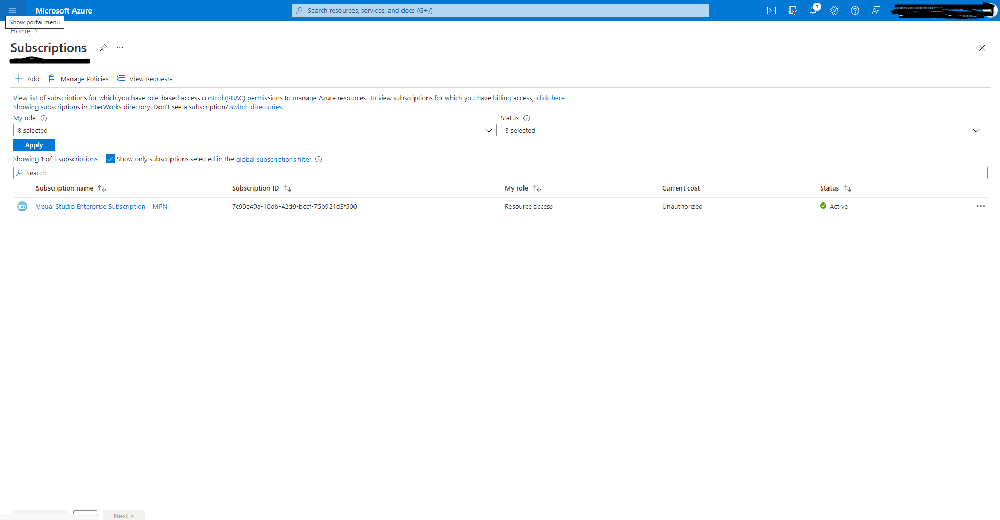
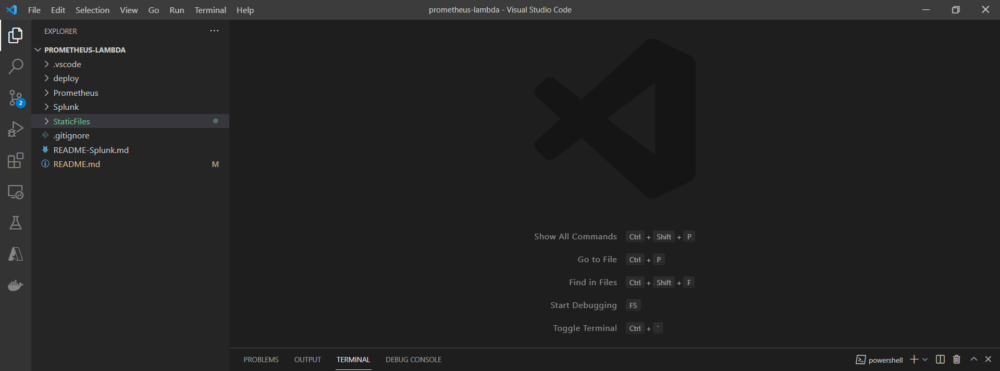

# Lambda function for Prometheus

AWS and GCP integration for fetch data from Prometheus

### Clouds
This repo contains a common function for AWS and GCP. We have some differences between AWS and GCP:
1. AWS uses binary for deploy;
2. GCP uses source code for deploy;
3. GCP uses a package. The package name must not be `main`;
4. GCP uses go.mod or vendor (go modules).


### Terrafrom
This repo contains two terraform script for AWS and GCP.

#### AWS resources:
1. Lambda;
2. API getaway;
3. KMS keys.

#### GCP resources:
1. Google Run;
2. Google Endpoints;
3. Google Function;
4. Google Bucket.

### Deploy:
1. Set env variables in `.env` file;
2. Run `source .env` to set environment; 
3. Run `make` to build a docker container;
4. Run `make deploy` for deploy to a cloud and choose cloud `AWS` or `GCP`;
5. Next: [Instruction for GCP](#GCP) \ [Instruction for AWS](#AWS).

#### GCP:
1. Set the major version;
2. Set the minor version (update each deploy to avoid deployment errors);
3. Set project name;
4. Set region deployment.

#### AWS:
1. Set API name. It will use as part of a path URL;
2. Set region for deployment.

#### Azure:
This is a quick quide on how get started with the Azure Proxy Function. Before starting with anything please make sure that all tools, CLIs  are installed on your machine and your own Azure Subscription. Install/purchase 
all things from this list:
1. [Azure Subscription](https://azure.microsoft.com/en-us/free/) - Purchase new Subscription if you don't have any. When this is done go to [Azure Portal](https://portal.azure.com) sign in with your credentials and go to the [Azure Subscription Blade](https://portal.azure.com/#blade/Microsoft_Azure_Billing/SubscriptionsBlade). If you see subscriptions in the list than your are good to go. Example: 
2. Download and Install [Azure CLI](https://docs.microsoft.com/en-us/cli/azure/install-azure-cli). Choose your OS type and follow the instructions. After you are done with this step go ahead and check if the CLI is installed by opening the terminal and type this command: ``` az --version```. The output should look like this: ```azure-cli                         2.0.81``` where version 2.0.81 is the current version of the moment of this writting. If you get any version than everything is ok
3. Download and Install [Func Core Tools](https://docs.microsoft.com/en-us/azure/azure-functions/functions-run-local?tabs=v3%2Cwindows%2Ccsharp%2Cportal%2Cbash%2Ckeda#install-the-azure-functions-core-tools) version 3. Choose your OS type and follow the instructions. After everything is completed go ahead and check if the Func Core Tools are installed by opening the terminal and type this command: ```func --version```. Sample output: ```3.0.3734```. Major version should be 3.
4. Download and Install [Terraform cli](https://www.terraform.io/downloads.html). Choose your OS type and read the user manual on the terraform site. Please make sure that the terraform executable is added to your OS env variables. Go to [this page](https://superuser.com/questions/284342/what-are-path-and-other-environment-variables-and-how-can-i-set-or-use-them) to see how to do that for your OS. After everything is done make sure that terraform CLI is installed by opening the terminal and type this command: ```terraform --version```. Sample output should be ```Terraform v1.0.7
on linux_amd64```. This sample is for Linux OS with AMD64. Depending on you OS type that may change but there should be Terraform version output like ```Terraform v1.0.7``` if everything is ok.
5. Download and install [VS Code](https://code.visualstudio.com/download). Choose your OS type. When everything is done make sure that VS Code is installed by opening the terminal and type this command ```code .```. If new VS Code window is opened then everything is ok.
6. Download and install [Git](https://git-scm.com/downloads). Choose your OS type. When everything is done make sure that git is installed by opening the terminal and type this command ```git --version```. Sample output: ```git version 2.33.0```. If there is a git version in the output then everything is good.


After all tools are here go ahead and clone the repo and navigate to the correct branch by using this commands from the terminal:
```git clone https://github.com/blamelesshq/prometheus-lambda.git```
```git checkout -b develop-petar```
```git pull origin develop-petar```

Now when you have the code go ahead to the clone directory root folder and open the folder in VS Code by typing this command from the terminal:
```code .``` 
You should see this folder structure in VS Code.  

Now that we have the code base and tools locally, and we have our own Azure Subscription next phase is to create all needed resources on Azure. That will be done using terraform. Before doing that let's give a short description about Azure resources.

1. First resource that needs to be created is Resource Group. **(Required Resource!)**
All resources in Azure are organized and placed in a container called [resource group](https://docs.microsoft.com/en-us/azure/azure-resource-manager/management/manage-resource-groups-portal#what-is-a-resource-group). This container and all other azure resources (objects) need to be placed in a certain Geographic Location called [regions](https://docs.microsoft.com/en-us/azure/availability-zones/az-overview). So the first resource that we need to create in Azure is Resource Group where all other resources will be put in. 
In order to do that with terraform, proper terraform script should be defined. Please navigate to the [Resource Group Terraform script](./deploy/azure/resourceGroup/main.tf) to see the script. In the first section:
```
provider "azurerm" {
  version = "=2.47.0"
  features {}
}
```
Proper [Terraform Azure Provider](https://registry.terraform.io/providers/hashicorp/azurerm/latest/docs) version is specified. For this sample version ```2.47.0``` is used. 

In the second section of the script:
```
resource "azurerm_resource_group" "rg" {
  name     = var.resource_group_name
  location = var.location
}
```
the actual resource group is defined. Name of the resource group (that should be unique in your Azure Subscription) and geographical location are defined in the [variables.tf](./deploy/azure/resourceGroup/variables.tf) file and they are both of type string. At the end after the execution of the terraform script newly created resource group id (guid) and resource group name are needed. That's why they are defined in [outputs.tf](./deploy/azure/resourceGroup/outputs.tf) file.

2. Azure Function App **(Required Resource!)**
[Azure Function App](https://docs.microsoft.com/en-us/azure/azure-functions/functions-overview) is a collection of one or more functions that are managed together. All functions in the function app share the same pricing plan which can be [Consumption plan](https://docs.microsoft.com/en-us/azure/azure-functions/consumption-plan), [Premium plan](https://docs.microsoft.com/en-us/azure/azure-functions/functions-premium-plan?tabs=portal) or [Dedicated plan](https://docs.microsoft.com/en-us/azure/azure-functions/dedicated-plan). Mainly Azure Functions are serverless solution that allows you to write less code, maintain less infrastructure, and save on costs.
In order to create Azure Function App using Terraform script couple of things needed to be specified.
Like any terraform script first thing that needed to be specified is Azure Provider version (same as in the resource group above)
```
provider "azurerm" {
  version = "=2.47.0"
  features {}
}
```
Second thing that need to be created is Azure Storage Account. This is required for Azure Function App. For more info why this is needed go to [Azure Function App Storage Account page](https://docs.microsoft.com/en-us/azure/azure-functions/storage-considerations). In our case this is the terraform section that does this:
```
resource "azurerm_storage_account" "funcdeploy" {
  name                     = var.storage_account_name
  resource_group_name      = var.resource_group_name
  location                 = var.location
  account_tier             = var.storage_account_tier
  account_replication_type = var.storage_account_replication_type
}
```
```name``` - is storage account name which need to be globally unique. Variable for that is defined in [variables.tf](./azure/deploy/function/variables.tf) file. Find more info [here](https://registry.terraform.io/providers/hashicorp/azurerm/latest/docs/resources/storage_account#name).
```resource_group_name``` - name of the resource group which is also defined in the [variables.tf](./azure/deploy/function/variables.tf) file. Same resource group name will be used that was created above (resource group section). Find more info [here](https://registry.terraform.io/providers/hashicorp/azurerm/latest/docs/resources/storage_account#resource_group_name)
```location``` - geographic location which is defined in [variables.tf](./azure/deploy/function/variables.tf) file. Find more info [here](https://registry.terraform.io/providers/hashicorp/azurerm/latest/docs/resources/storage_account#location). See all possible values [here](https://github.com/claranet/terraform-azurerm-regions/blob/master/REGIONS.md)
```account_tier``` - Defines tier for storage account and is defined in [variables.tf](./azure/deploy/function/variables.tf) file. For more info go [here](https://registry.terraform.io/providers/hashicorp/azurerm/latest/docs/resources/storage_account#account_tier). Valid options are Standard and Premium.
```account_replication_type``` - Defines Storage account replication type and it's defined in [variables.tf](./azure/deploy/function/variables.tf) file. Find more info [here](https://registry.terraform.io/providers/hashicorp/azurerm/latest/docs/resources/storage_account#account_replication_type) and [here](https://docs.microsoft.com/en-us/azure/storage/common/storage-redundancy). Valid options are LRS, GRS, RAGRS, ZRS, GZRS and RAGZRS.

Third thing that needs to be created is [storage account blob container](https://docs.microsoft.com/en-us/azure/storage/blobs/storage-blobs-introduction) needed for the azure function. That is defined in this section:
```
resource "azurerm_storage_container" "funcdeploy" {
  name                  = "contents"
  storage_account_name  = azurerm_storage_account.funcdeploy.name
  container_access_type = "private"
}
```
```name``` - Container name
```storage_account_name``` - name of the storage account created in above step
```container_access_type``` - Access level on the container. Should be private (doesn't need to be accessable from outside)
More info for container can be found [here](https://registry.terraform.io/providers/hashicorp/azurerm/latest/docs/data-sources/storage_container).

Fourth thing that is specified but it is optional is Application Insights. This resource is for monitoring AzureFunction (both application and system monitor). It's not a must but it is recommended to have. That is defined in this section:
```
resource "azurerm_application_insights" "funcdeploy" {
  name                = var.appinsights_name
  location            = var.location
  resource_group_name = var.resource_group_name
  application_type    = "web"

  # https://github.com/terraform-providers/terraform-provider-azurerm/issues/1303
  tags = {
    "hidden-link:${var.resource_group_id}/providers/Microsoft.Web/sites/${var.azure_func_name}" = "Resource"
  }

}
```
```name``` - Name of app insights. It's defined in [variables.tf](./azure/deploy/function/variables.tf) 
```location``` - Geographic location (same as above)
```resource_group_name``` - Same as above
```application_type``` - Type of application insights that needed to be created. More info can be found [here](https://registry.terraform.io/providers/hashicorp/azurerm/latest/docs/resources/application_insights#application_type).
```tags``` - Tags section is optional. It helps us to organize resources better and add better description why they are used. In our case the description is that this app insights instance is used to monitor azure function app with certain id located in certain resource group.

Fifth thing that is specified is App Service Plan. In our example we are using App Service Plan Tier.
```
resource "azurerm_app_service_plan" "funcdeploy" {
  name                = var.functionapp_name
  location            = var.location
  resource_group_name = var.resource_group_name
  kind                = "FunctionApp"
  reserved            = true

  sku {
    tier = var.sku_tier
    size = var.sku_size
  }
}
```
For name, location, resource_group_name is the same description as above. 
```kind``` - For what are we going to use this AppService Plan instance? More info can be found [here](https://registry.terraform.io/providers/hashicorp/azurerm/latest/docs/resources/app_service_plan#kind).
```tier``` - Specifies App Service Plan Pricing tier. Find more about tiers [here](https://azure.microsoft.com/en-us/pricing/details/app-service/linux/)
```size``` - this is related to tier size. Each tier can have dirrent size (instance types). More info can be found [here](https://azure.microsoft.com/en-us/pricing/details/app-service/linux/)

Last thing that needs to be created is the actual Azure Function App. That's defined in this section:
```
resource "azurerm_function_app" "funcdeploy" {
  name                       = var.azure_func_name
  location                   = var.location
  resource_group_name        = var.resource_group_name
  app_service_plan_id        = azurerm_app_service_plan.funcdeploy.id
  storage_account_name       = azurerm_storage_account.funcdeploy.name
  storage_account_access_key = azurerm_storage_account.funcdeploy.primary_access_key
  https_only                 = true
  version                    = "~3"
  os_type                    = "linux"
  # To see this - https://registry.terraform.io/providers/hashicorp/azurerm/latest/docs/resources/function_app#vnet_route_all_enabled 
  app_settings = {
      "WEBSITE_RUN_FROM_PACKAGE" = "1"
      "FUNCTIONS_WORKER_RUNTIME" = "custom"
      "APPINSIGHTS_INSTRUMENTATIONKEY" = "${azurerm_application_insights.funcdeploy.instrumentation_key}"
      "CLOUD_PLATFORM" = "${var.CLOUD_PLATFORM}"
      "PROMETHEUS_PASSWORD" = "${var.PROMETHEUS_PASSWORD}"
      "PROMETHEUS_LOGIN" = "${var.PROMETHEUS_LOGIN}"
      "RESTO_URL" = "${var.RESTO_URL}"
      "PROMETHEUS_URL" = "${var.PROMETHEUS_URL}"
  }


  # Enable if you need Managed Identity
  identity {
    type = "SystemAssigned"
  }
}
```
name, location, resource_group_name, app_service_plan_id, storage_account_name, storage_account_access_key are coming from previously created resources and in this final step we relate them to the actual azure function app. Other sections are:
```https_only``` - Config that enables function app to allow only https traffic
```version``` - Function version which is set up to version 3 in our example
```os_type``` - OS type which is linux in our example.
```app_settings``` - Application environment variables. CLOUD_PLATFORM, RESTO_URL, PROMETHEUS_LOGIN, PROMETHEUS_PASSWORD, CLOUD_PLATFORM are app specific. Other configs - WEBSITE_RUN_FROM_PACKAGE tells that app can be run from zip package (function app), FUNCTIONS_WORKER_RUNTIME (programming runtime. In our case is custom - we are using Go), APPINSIGHTS_INSTRUMENTATIONKEY - application insights that that was created above.
```identity``` - this is enabling managed identity for the function app in order for function to be able to access other Azure Resource securely without going outside of Azure Network. This will be needed in the future for access to the KMS system (Azure Key Vault) from the Function App.

Main terraform script is defined [here](./deploy/azure/function/main.tf), together with the [variables](./deploy/azure/function/variables.tf) and [outputs.tf](./deploy/azure/function/outputs.tf) - variables needed in the next terraform scripts (modules).

3. Azure Key Vault


(TO DO)
-----------------------------------------------------

Azure terraform scripts are split into 6 modules for creation of the resources.
- [ApiManagement](./deploy/azure/apiManagement) (optional)
 -> ApiManagement resource that will route traffic to single/multiple proxy function(s). Has single endpoint. It is not required since each proxy function(s) has/have endpoint.
- [KeyVault](./deploy/azure/keyvault) (optional)
 -> Secure key management service that is Azure Specific. All secrets needed for Azure Proxy Function(s) should be stored here (like ConnectionStrings, Passwords, Credentials). These secrets can be stored as an environment variables on Azure Function App as well which is why this is an optional resource
- [KeyVaultAccess](./deploy/azure/keyvaultAccess) (optional)
 -> Access policy between keyvault and Azure Function App. If KeyVault is not created than this is optional
- [NatGateway](./deploy/azure/natGateway) (optional)
 -> Multiple resources are created in this template. Main idea with this is for the Azure Function App to have only one outbound ip address and only that address to be whitelisted on the server (splunk/prometheus) side as an allowed address. Resources created: Virtual Network, Subnet, NatGateway, Virtual Network Connection to the Function App. This is optional since if not created there are multiple outbound address for the function app and all of them need to be whitelisted.

All optional modules can be commented out from the [main](./deploy/azure/main.tf) terraform file if not used.

[Terraform.tfvars](./deploy/azure/terraform.tfvars) file should store all values needed for [main](./deploy/main.tf) terraform script.

In order to execute current terraform scripts you need to navigate to this "./deploy/azure/" directory and follow these steps by using Terraform CLI:
1. terraform init (find more info [here](https://www.terraform.io/docs/cli/commands/init.html))
2. terraform plan -out tfplan (find more info [here](https://www.terraform.io/docs/cli/commands/plan.html)), where tfplan is terraform plan name (can be anything)
3. terraform apply tfplan (find more info [here](https://www.terraform.io/docs/cli/commands/apply.html))

For more info about how to create Azure resources with terrafom go to this [page](https://registry.terraform.io/providers/hashicorp/azurerm/latest/docs).

At the end when all terraform resources are created Azure Proxy Function should be deployed. One way of how to deploy Azure Function is to use Azure Function Core Tools. First, you need to navigate to your Azure Function Core directory and execute this command:
```func azure functionapp publish <function-app-name>``` 
where "function-app-name" (placeholder in the example) is the name of your function app. Prerequisite for doing this is to be logged in to your Azure Subscription using azure CLI.