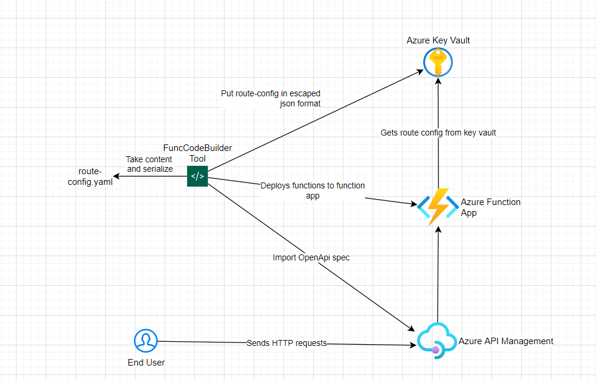

### Proxy Function Code, Config builder and Function Deployment Tool

At the root directory of the proxy function there is one declarative configuration file - [route-config.yaml](../Splunk/route-config.yaml). 

Sample:

```functions:
- route: "/api/fetch"
  url: "http://104.211.56.83:8089"
  accessToken: "string_token"
  type: "Splunk"
- route: "/api/fetch3"
  url: "http://104.211.56.83:8089"
  accessToken: "string_token"
  type: "Splunk"
- route: "/api/fetch4"
  url: "http://104.211.56.83:8089"
  accessToken: "string_token"
  type: "Prometheus"  
```

This route-config is set up as an environment variable (RouteConfig) in the escaped JSON format on Azure. The goal of this route config is to define as much Function Apps as we want with proper routes (that need to be distinct), url (server url), accessToken, type.

Azure Function App doesn't support this kind of config natively and for that reason custom Console tool is build. Tool source code can be find in this [directory](../FuncCodeBuilder/CodeBuilder). Tool is build in .NET 6.

The tool reads the content of the file (in yaml format) parse it to escaped json and puts the value in KeyVault. The tool takes the total number of functions from the functions array object of the route-config.yaml file and creates/updates [API Management Open API spec](../deploy/azure/api-spec.yml) and adds additional Functions in the Azure Function App. After that is done the tool deploys the function app and after the deployment is done it deletes all necessary folders needed in the deployment process.

The tool is used in both Initial Azure Resources creation and proxy Function Update processes.

As an arguments tools expect these parameters:
- Type (as a first argument, with possible values: [FunctionApp, ApiManagement] ) 
- Proxy Function Root Directory (as a second argument)
- Terraform Azure Deployment root directory (as a third argument if Type is ApiManagement)
- Azure Function Name (as a forth argument)
- Azure KeyVault Name (as a third argument if Type is FunctionApp)

For the more visual workflow please refer to this diagram:



Digram source (DrawIO) can be find [here](./StaticFiles/FuncCodeToolBuilder.drawio)